# Gamer Quiz

# Introduction

 Welcome to the Gamer Quiz, A terminal based quiz game.

 Live site link: https://gamer-quiz.herokuapp.com/

 

# Table of contents

# User Experience
  ## Target Audience
  It is targeted at people that want to play a quiz game.
  ## Owner Stories
   
  ## User Stories
  As a user
    - I want to play a game so I can test my gaming knowledge.
    - I want the rules or instructions clearly set out so I understand what im doing
    - I want to be able to leave the game easily if I need to leave early
    - I want the option of being able to play the game again to better my last score
  ## Design

# Features

  ## Logo
  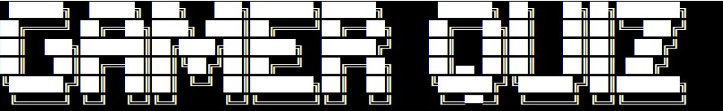
   - The Logo is the first thing printed to the screen when the program runs.
   - It is printed out in an animation style effect to add visual interest.
   - It also clearly gets accross to the user what the program is about.
  ## Welcome message
  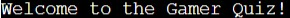
   - The user is then welcomed
  ## Username
  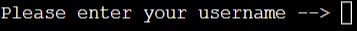

  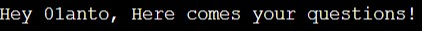
   - The user is then asked for their username
   - The username is then repeated to tell them that the questions are about to begin
  ## Acceptable answers
  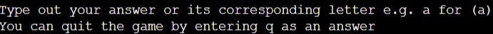
   - The user is then informed what input the program is expecting.
  ## Questions
  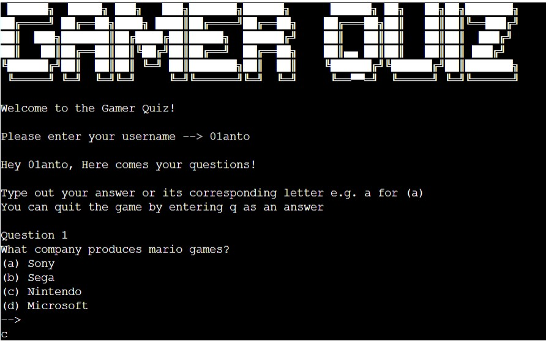
   - The user is then presented with a question.
   - The program continues to ask a question until all questions have been asked.
   - The user can quit anytime by passing q as an answer.
  ## Correct/Incorrect messages
  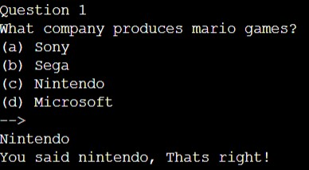
  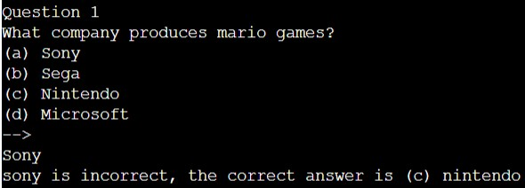
   - The program will inform the user if they get the question right or wrong
   - If the user does not enter a valid answer, it wont be accepted and will request a valid input
  ## Number of questions correct and specific message
  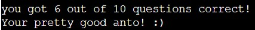
  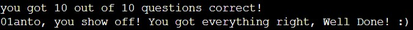
  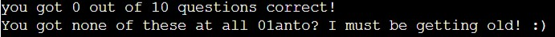
   - If the user plays the game to the end they will be presented with their score.
   - They will also get a specific message depending on what their score is.
  ## Play game again or quit

  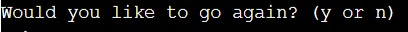
   - The user will then be asked if they would like to play again.
  
  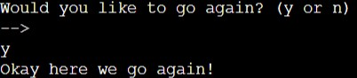
   - If the user enters y a message is printed before the program restarts.
  
  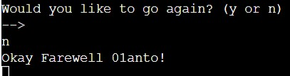
   - If the user enters n a message is printed before exiting.

# Future Features

  ## More Questions
   - Add extra lot of questions to make the quiz longer.

  ## Lives
   - Add lives so that user can only get a set number of questions wrong.

  ## Scoreboard
   - Implement a spreadsheet to be used for high scores.

# Testing

  ## Correct Input Testing
  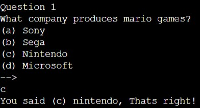
  - The program will accept a correct lowercase option.
  
  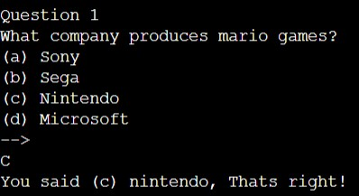
  - The program will accept a correct uppercase option.
  
  
  - The program will accept a correctly spelled word as an answer.
  
  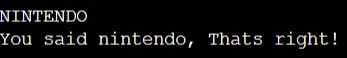
  - The program will accept a correctly spelled uppercase word as an answer.
  
  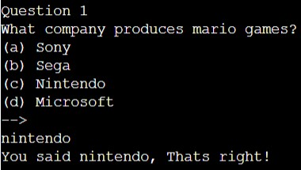
   - The program will accept a correctly spelled lowercase word as an answer.
  
  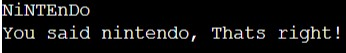
   - The program will accept a correctly spelled lowercase and uppercase word as an answer.
  
  ## Incorrect Input Testing
  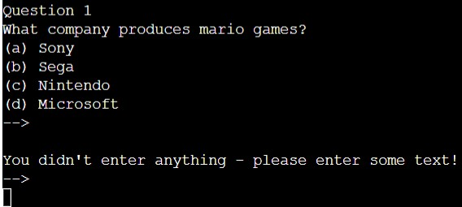
   - The program will not accept a blank input.
  
  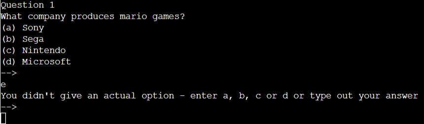
   - The program will not accept an incorrect option.
  
  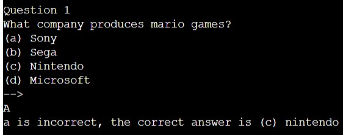
   - The program will not accept an incorrect capital option.
  
  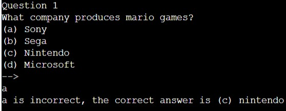
   - The program will not accept an incorrect lowercase option.
  
  
   - The program will not accept an incorrect word.
  
  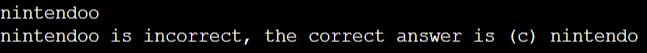
   - The program will not accept a word that is spelled incorrectly.
  
  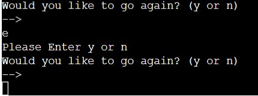
   - The program will not accept any values other than y or n to play game again or quit.
  
  ## Validator Testing

   - Validator Installation

    - Pep8online.com website was not available
    - As instructed by Code Institute staff a pep8 validator (pycodestyle) was used in my Gitpod workspace
    - The command pip3 install pycodestyle was used but the extension was already installed
    - Press Ctrl+Shift+p to open search bar and type linter
    - Click on Python: Select Linter and then select pycodestyle.
    - Errors were underlined in red and listed in the problems tab beside the terminal
 
# Bugs

  ## Fixed Bugs
  - Many line length and trailing whitespace errors were fixed with the use of the pep8 gitpod validator.
  
  ## Unfixed Bugs
  - Some minor line length and trailing whitespace errors remain as highlighted by the pep8 gitpod validator.
  - This has been left as I could not alter the code layout in a sufficient way without causing more serious errors.

# Deployment

- Before Heroku Deployment I ensured that:

   - Code is located in a run.py file
   - Code Institute template files have not been edited
   - All input statements in program code end with \n so they display on Heroku
   - Requirements.txt has been updated using the command pip3 freeze > requirements.txt

- I then deployed my project by completing the below steps:

   - Log in to Heroku and click on create new app button
   - Enter project name, select region and and click create app
   - Click on the settings tab and click on reveal config vars
   - Add 'PORT' as a key and '8000' as a value then click add
   - Click on Add buildpack
   - Click Python and then save changes
   - Click nodejs and then save changes
   - Click on Deploy, select GitHub for the Deployment method and then select Connect to GitHub
   - Enter repository name, click Search and then Connect
   - In Manual deploy click Deploy Branch(I later went to Automatic deploys and clicked Enable Automatic Deploys to allow the app to update when i push to GitHub)
   - Click on the view button (or Open App at top of page if returning) to see the deployed project.

# Languages Used

 - Python 3

# Technologies, Frameworks and Libraries used

 - [Python template](https://github.com/Code-Institute-Org/python-essentials-template)
   - The Code Institute's Python essentials template has been used for this project

 - [Gitpod IDE](https://www.gitpod.io/)
   - All code for this project was created using Gitpod

 - [GitHub](https://github.com/)
   - All code for this project was added, commited and pushed to github

 - [Heroku](https://www.heroku.com/)
   - This project was deployed using heroku
    
 - [Techsini](https://techsini.com/multi-mockup/index.php)
   - The mockup image for the readme was created using Techsini
    
 - [TOC Generator](http://ecotrust-canada.github.io/markdown-toc/)
   - The Readme table of contents was created using the TOC Generator
   
# Credits

  ## Media

   - [ASCII logo](https://manytools.org/hacker-tools/ascii-banner/)
    - The ASCII logo was created using a tool from this site. I then divided the logo up
	and saved these into seperate text files to help provide an animation style effect.

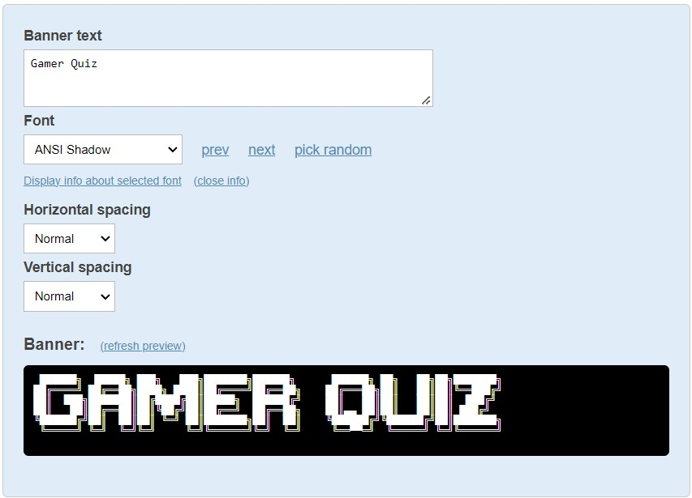

  ## Acknowledgements

   - I would like to thank my mentor Spencer Barriball for all his help and advice throughout
     this project.